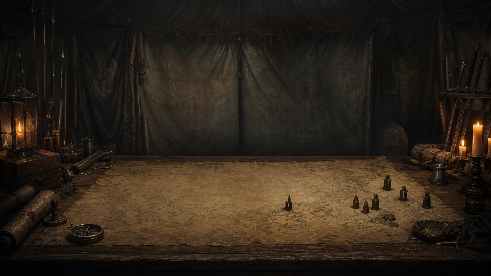

# Dark Dimensions



> A dark-fantasy roguelike about raising a Warband, surviving a living world, and accepting that every decision is permanent.

**Dark Dimensions** is an browser RPG that combines free world-map travel, tactical card battles, troop progression, trading, survival logistics, and a strict Ironman campaign. Every run creates a new realm from a world seed. Cities, roads, factions, markets, threats, and opportunities change with it.

The project is in active development. Systems, balance, lore, and artwork may change substantially.

## The fantasy

You are the Wanderer: an unclaimed commander crossing the Shattered Realms with little more than an origin, an oath, and the people willing to follow your banner. Recruit levies in distant cities, turn survivors into veteran specialists, trade where scarcity creates opportunity, and decide which powers deserve your loyalty.

There are no manual saves and no harmless defeats. The game records the run automatically when locations are entered and battles begin or end. If the Wanderer dies, that run is over.

## What makes a run

- **Procedural realm** — seeded geography, settlements, roads, factions, encounters, economies, and city names.
- **Ironman persistence** — one automatic save; death permanently ends the campaign.
- **Tactical card battles** — summon units, recall them, draw reinforcements, and issue a leader command before formations resolve the round.
- **A living Warband** — troops have persistent health, wages, battle experience, and authored branching upgrade paths.
- **Scarce recruitment** — each city offers a small persistent roster. Better recruits are rare, expensive, and tied to local prosperity and military strength.
- **Travel pressure** — food, morale, wages, terrain, darkness, cargo weight, and hostile patrols turn distance into a strategic cost.
- **Regional economy** — settlements produce different goods, stock is finite, scarcity changes prices, and caravans physically move supplies.
- **Factions and contracts** — build reputation through delivery, bounty, and escort work for rival powers.
- **Character origins** — race, childhood, upbringing, and a defining turning point shape starting attributes, skills, equipment, and gold.

## The world at a glance

The Shattered Realms are held together by roads older than their kingdoms. Three powers compete for the cities that still stand:

| Faction | Identity | Relations |
| --- | --- | --- |
| **The Ember Crown** | A royal remnant built around oath, inheritance, and guarded trade roads. | Friendly toward the Iron Concord; hostile to the Gloam Compact. |
| **The Gloam Compact** | A coalition thriving in secrecy, twilight commerce, and contested borders. | Hostile to both rival powers. |
| **The Iron Concord** | A disciplined alliance of fortified settlements, smiths, and professional armies. | Friendly toward the Ember Crown; hostile to the Gloam Compact. |

Humans still control most city walls, but they are not alone. Kobolds hold the tunnels, orcs endure the ash wastes, revenants walk roads that should have ended, and stranger creatures gather where the dimensions have worn thin.

Read the current worldbuilding draft in [The Shattered Realms](docs/LORE.md).

## Battle loop

1. Draw an opening hand and prepare a limited formation.
2. Spend up to three tactical actions to summon, recall, or draw.
3. Choose the Wanderer's leader command.
4. Resolve initiative, attacks, defensive effects, healing, and piercing damage.
5. Survive with persistent casualties and wounds.
6. Select spoils, capture prisoners, and award XP only to participating survivors.

Units upgrade directly through battle experience:

| Current tier | XP required |
| ---: | ---: |
| Tier 1 | 100 XP |
| Tier 2 | 150 XP |
| Tier 3 | 200 XP |
| Tier 4 | 250 XP |
| Tier 5 | 300 XP |

Unused troops receive no battle XP. Excess XP and the unit's health percentage carry into an upgrade.

## Current development status

Implemented foundations include:

- procedural world generation and terrain-aware pathfinding
- cities, villages, castles, dungeons, landmarks, and roaming encounters
- tactical battles with leader commands and persistent Warband casualties
- Ironman autosaves and battle checkpoints
- fullscreen start, city, market, recruitment, and Warband interfaces
- finite markets, settlement production, caravans, cargo, and workshops
- limited city recruitment with deterministic restocks
- equipment, consumables, prisoners, wages, food, morale, and healing
- factions, reputation, delivery contracts, bounties, and escorts
- character creation with origin-dependent bonuses
- an integrated content studio for cards, items, terrain art, and upgrade paths

See the [development roadmap](docs/ROADMAP.md) for planned work and the [gameplay guide](docs/GAMEPLAY.md) for a more detailed systems overview.

## Screens and artwork

| City sanctuary | Warband command tent |
| --- | --- |
|  |  |

Artwork in the repository is development material and may be replaced before release. Do not assume redistribution rights outside this project unless an asset's license explicitly permits it.

## Development

### Requirements

- Node.js 20 or newer
- npm
- a modern desktop browser

### Run locally

```bash
npm install
npm run dev
```

The development server prints a local URL, normally `http://localhost:5173`.

### Validate

```bash
npm test
npm run build
```

## Controls

| Input | Action |
| --- | --- |
| `WASD` | Move across the world |
| Arrow keys | Pan the camera |
| `Space` | Recenter the camera |
| Mouse | Select destinations, units, cards, and menu actions |
| `Escape` | Open or close the campaign menu when no other ledger is active |

## Technology

- **React 19** for menus, ledgers, and state-driven UI
- **Phaser 3** for the rendered world
- **TypeScript** for domain rules and application code
- **Vite** for development and production builds
- **Vitest** for automated tests
- **Zod** for versioned content validation
- **IndexedDB** for the Ironman autosave

The simulation remains independent from Phaser. Serializable domain state owns the world, battles, economy, time, and progression; React and Phaser render that state without becoming its source of truth. More detail is available in [Architecture](docs/ARCHITECTURE.md).

## Repository map

```text
src/content/          Authored cards, enemies, items, upgrades, and map content
src/domain/           Serializable game rules and simulation state
src/infrastructure/   Persistence adapters and save contracts
src/phaser/           World rendering and input forwarding
src/ui/               React menus, HUDs, ledgers, and styles
public/assets/        Runtime art, music, sprites, and item imagery
docs/                 Lore, gameplay, architecture, and roadmap
```

## Project documents

- [World and lore](docs/LORE.md)
- [Gameplay systems](docs/GAMEPLAY.md)
- [Development roadmap](docs/ROADMAP.md)
- [Technical architecture](docs/ARCHITECTURE.md)

## Project status and contributions

Dark Dimensions is currently a private, experimental game project rather than a finished public release. Bug reports and design discussion are welcome when the repository is opened for collaboration, but mechanics and content should be considered work in progress.

The original `cards.js` remains in the project as migration source material and is not loaded by the current application.
